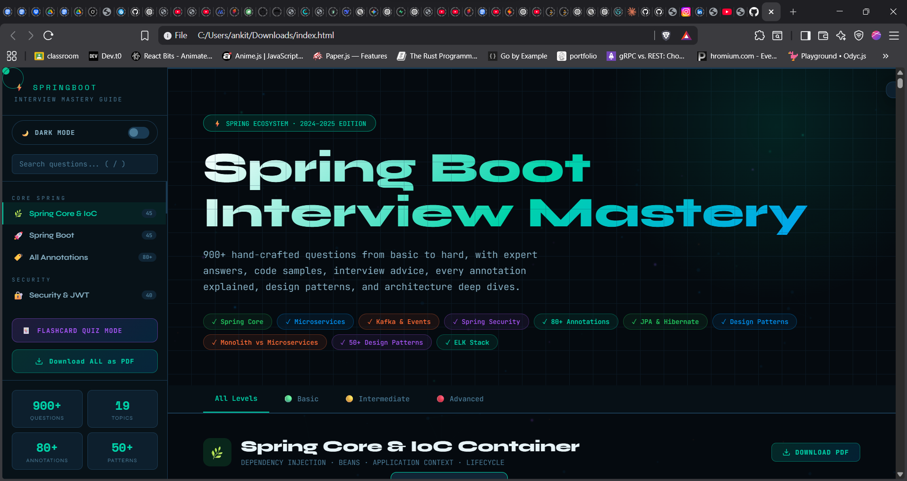

<div align="center">

<!-- Animated Header Banner -->


<!-- Animated Typing SVG -->
<a href="https://github.com/ankit-7i/Springboot-microservices-systemdesign-interview-guide">
  
</a>

<br/>

<!-- Badges Row 1 -->
<p>
  
  
  
  
</p>

<!-- Badges Row 2 -->
<p>
  
  
  
  
</p>

<!-- Stars / Forks -->
<p>
  <a href="https://github.com/ankit-7i/Springboot-microservices-systemdesign-interview-guide/stargazers">
    
  </a>
  <a href="https://github.com/ankit-7i/Springboot-microservices-systemdesign-interview-guide/network/members">
    
  </a>
  <a href="https://github.com/ankit-7i/Springboot-microservices-systemdesign-interview-guide/issues">
    
  </a>
</p>

</div>

---

## 🎯 What is This?

> **A single-file, zero-dependency interactive web app** — your complete Spring Boot interview preparation toolkit. Open the HTML file in any browser and get instant access to 900+ expert-crafted questions, interactive quizzes, flashcards, interview simulation with timer, and a full readiness dashboard.

**Built for:**
- 🎓 Java developers preparing for senior/mid-level interviews
- 📚 Self-learners deepening their Spring ecosystem knowledge  
- 🏢 Tech leads building structured onboarding resources
- 🧑‍💼 Recruiters who want to understand what strong Spring candidates know

---

## ✨ Feature Showcase

<div align="center">

<!-- Feature cards using HTML tables in markdown -->

| 🎯 Interview Simulation | 🃏 Flashcard Mode | 📊 Readiness Dashboard |
|:---:|:---:|:---:|
| Timed mock interviews with 2-min countdown per question. Rate yourself Easy / Hard / Again. Tracks weak areas. | Classic flip-card style. Question front, answer back. Keyboard shortcuts for speed. | Visual progress tracking per topic. Readiness % score. Weak area identification. |

| 🔖 Bookmark System | 🔍 Smart Search | 🌙 Light/Dark Mode |
|:---:|:---:|:---:|
| Save any question with one click. Persisted in localStorage. Accessible from floating action bar. | Searches questions + answers + code blocks. Highlights matched text. Live result count. | Fully themed light mode with a toggle switch. Preference saved across sessions. |

</div>

---

## 🚀 Quick Start

```bash
# Option 1: Clone & open (zero setup)
git clone https://github.com/ankit-7i/Springboot-microservices-systemdesign-interview-guide.git
cd Springboot-microservices-systemdesign-interview-guide
open index.html          # macOS
start index.html         # Windows
xdg-open index.html      # Linux

# Option 2: Direct download
# Download index.html → open in any browser → done ✅
```

> **No Node.js. No npm install. No build step. No server.** Just open and study.

---

## 📚 Topics Covered

<div align="center">

| Core | Security | Data | Architecture |
|:---|:---|:---|:---|
| 🌿 Spring Core & IoC | 🔐 Spring Security & JWT | 🗄️ Spring Data JPA | 🔗 Microservices |
| 🚀 Spring Boot | 🔑 OAuth 2.0 & OIDC | 🏗️ Hibernate & ORM | 🏛️ Microservices Deep Dive |
| 🏷️ 80+ Annotations | &nbsp; | &nbsp; | 🧱 Monolithic Architecture |

| Messaging | Reliability | Advanced | Reference |
|:---|:---|:---|:---|
| 📨 Kafka & Events | ⚡ Circuit Breaker (Resilience4j) | 🎯 Spring AOP | 🎨 50+ Design Patterns |
| &nbsp; | 📦 Spring Batch | ⚡ Caching | 💻 Production Code Examples |
| &nbsp; | &nbsp; | 📊 ELK Stack & Tracing | ⚖️ Load Balancing |

</div>

---

## ⌨️ Keyboard Shortcuts

```
J / K         →  Navigate between questions
Space         →  Expand / collapse current question
B             →  Bookmark current question
F             →  Open Flashcard mode
S             →  Start Interview Simulation
D             →  Open Readiness Dashboard
T             →  Toggle Light / Dark mode
/             →  Focus search box
Esc           →  Close any open panel
```

---

## 🛠️ Tech Stack

<div align="center">

<p>
  
  
  
  
  
</p>

</div>

| Layer | Technology | Why |
|:---|:---|:---|
| **UI** | Pure HTML5 + CSS3 | Zero framework overhead. Instant load. |
| **Logic** | Vanilla JavaScript (ES2022) | No bundle. No dependencies to break. |
| **Animations** | CSS keyframes + Canvas API | 3D particle background, smooth transitions |
| **PDF Export** | jsPDF (CDN) | Client-side PDF — no server needed |
| **Persistence** | localStorage | Bookmarks, progress, theme preference |
| **Fonts** | Google Fonts (Syne + JetBrains Mono) | Clean, professional, developer-aesthetic |

---

## 📸 Preview

<div align="center">



</div>

---

## 🗺️ Roadmap

- [x] 900+ questions across 20 topics
- [x] Interview simulation with timer & self-rating
- [x] Flashcard mode
- [x] Bookmarks with localStorage persistence
- [x] Smart search with highlight
- [x] Readiness dashboard with weak-area tracking
- [x] Light/Dark mode toggle
- [x] PDF export per topic + full guide
- [x] Keyboard navigation
- [ ] Spaced repetition algorithm (SM-2)
- [ ] Import/export progress as JSON
- [ ] Community question contributions
- [ ] Mobile PWA support

---

## 🤝 Contributing

Contributions are warmly welcome! Whether it's fixing a typo, improving an answer, or adding new questions.

```bash
# Fork → Clone → Branch → PR
git checkout -b feat/add-spring-ai-questions
# Add your questions to the DATA object in index.html
git commit -m "feat: add Spring AI interview questions"
git push origin feat/add-spring-ai-questions
# Open a Pull Request 🎉
```

**Question format:**
```javascript
{ 
  q: 'Your question here?', 
  level: 'basic' | 'mid' | 'hard',
  a: `Your HTML answer here`,
  code: `Optional Java code example`,
  advice: 'Optional interview tip'
}
```

---

## 📄 License

Distributed under the **MIT License**. See `LICENSE` for more information.

---

<div align="center">

<!-- Footer wave -->


**Made with ❤️ for the Java developer community**

<p>
  <a href="https://github.com/ankit-7i">
    
  </a>
  &nbsp;
  <a href="https://www.linkedin.com/in/ankitrout07/">
    
  </a>
</p>

⭐ **If this helped you land your dream job, please star the repo!** ⭐

<br/>


</div>
